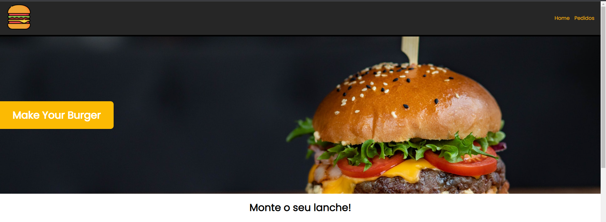
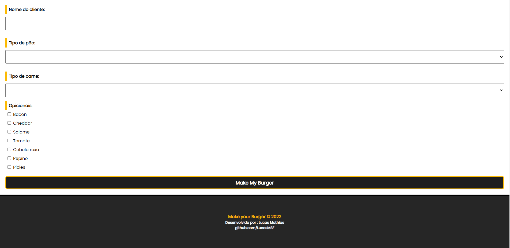
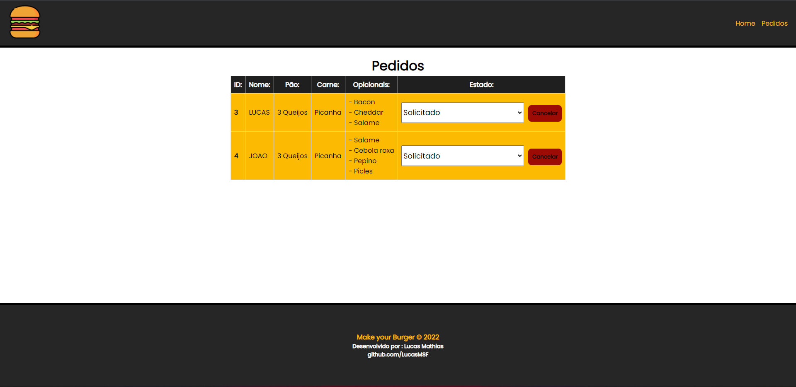
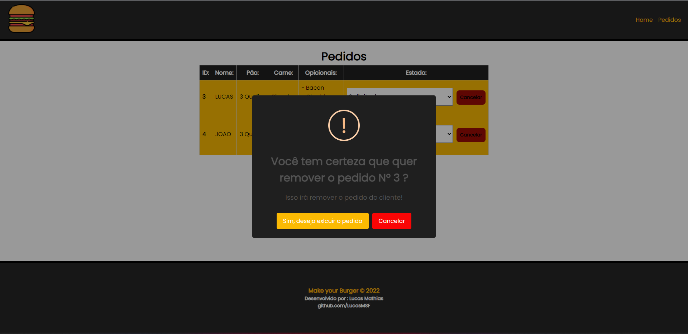

<h1 align="center">
   🍔 <a href="#"> Make Your Burger</a> 🍟
    
   </img>
   </img>

</h1>

 <a href="#sobre">Sobre</a> •
 <a href="#como-executar-o-projeto">Como Executar o Projeto</a> •
 <a href="#imagens">Imagens</a> •
 <a href="#feito-com">Feito com</a> • 
 <a href="#autor">Autor</a>

## Sobre

Esse projeto foi desenvolvido junto a um curso com o objetivo de mostrar/exercictar meus conhecimentos em Vue.js.

Vue.js é um framework JavaScript de código-aberto, focado no desenvolvimento de interfaces de usuário e aplicativos de página única

## Como Executar o Projeto ?

O Projeto utiliza o Babel para compilar o 
código

Para executar o projeto, siga os seguintes passos:

 

* Abra o terminal dentro da pasta do projeto e execute o comando "npm run serve"

 

* Para iniciar a API execute o comando "npm run api"

 

Após isso acesse a URL localhost:8080

<strong>Observação:</strong> Para compilar a projeto para 
produção deve-se usar o comando "npm run build".

## Imagens

<h4>Home</h4>

 
<h4>Formulário</h4>

 
<h4>Tabela de pedidos</h4>

 
<h4>Alertas customizados</h4>

 
<h4>Mobile</h4>

## Recursos

- [x] Vue Router
       
- [x] Vue Components
       
- [x] Vue Directives
       
- [x] LifeCycle Hooks
       
- [x] Requisições com axios
       
- [x] API Json-server
       
- [x] Biblioteca SweetAlert

## Feito com

    
    
    
    

## Autor

<a href="https://github.com/lucasMSF">
 
  
 <b>Lucas Mathias</b></a> 
  

